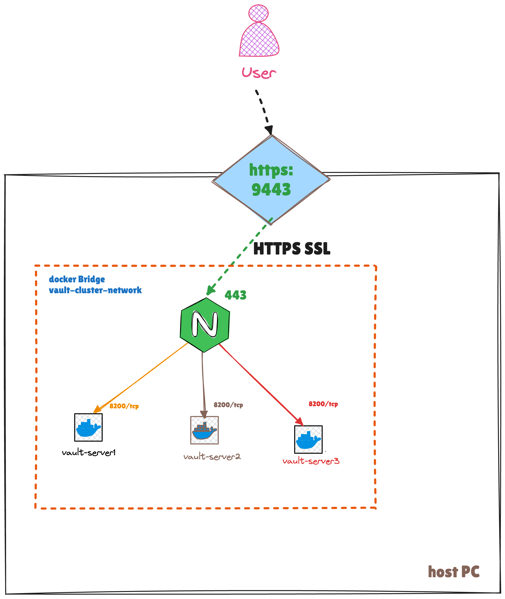

## Directory Structure

```
.
├── docker-compose.yaml           # Main configuration file
├── unseal-script/                # Contains initialization scripts
│   ├── vault-init.sh             # Primary node initialization
│   └── vault-raft-join.sh        # Secondary nodes join script
├── vault-server1/                # Primary node config
├── vault-server2/                # Secondary node config
├── vault-server3/                # Secondary node config
└── load-balancer/
    ├── config/
    │   └── nginx.conf            # NGINX configuration
    ├── certs/                    # SSL certificates
    └── logs/                     # NGINX logs
```


Architecture Overview


3 Vault server nodes in a Raft-based HA cluster
NGINX load balancer with SSL termination
Docker volumes for persistent storage
Initialization and auto-unseal scripts

Components

Based on hashicorp/vault:1.19 Docker image
Configured in a high-availability cluster using the Raft storage backend
Server 1 acts as the initializing node for the cluster
Servers 2 and 3 automatically join the Raft cluster

Load Balancer

NGINX for distributing requests across all Vault nodes
SSL termination (port 9443)


Getting Started

Ensure Docker and Docker Compose are installed on your system
Clone this repository
Run start.sh


